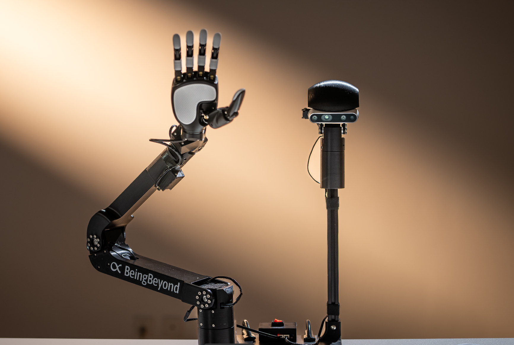

<p align="center">
  
</p>

# BeingBeyond D1 SDK 示例

本仓库提供 BeingBeyond D1 SDK、示例 Python 脚本，以及环境配置与常见问题的基本指引。

> **警告**  
> 请务必将急停按钮放在随手可触的位置。

---

## 1. 环境要求

### 1.1 硬件
- BeingBeyond D1 机器人  
  - 头部 + 机械臂  
  - 灵巧手  
  - RealSense 相机  
- Linux PC（Ubuntu 20.04 / 22.04）或 Windows（即将支持）  
- USB 3.0 接口  

### 1.2 软件
- Python 3.8 或 3.10  
- pyrealsense2  
  - `pip install pyrealsense2`
- SDK 轮子文件（位于 `/lib`，根据 Python 版本选择）：  
  - `beingbeyond_d1_sdk-0.2.0-cp38-cp38-manylinux_2_17_x86_64.manylinux2014_x86_64.whl`  
  - `beingbeyond_d1_sdk-0.2.0-cp310-cp310-manylinux_2_17_x86_64.manylinux2014_x86_64.whl`  
- Windows 版本将于后续发布。

---

## 2. 安装步骤

### 2.1 创建 Conda 环境

```bash
conda create -n bb_d1 python=3.8 -y
conda activate bb_d1
```

### 2.2 安装 SDK

```bash
pip install -U pip
pip install lib/beingbeyond_d1_sdk-0.2.0-cp38-cp38-manylinux_2_17_x86_64.manylinux2014_x86_64.whl
```

### 2.3 安装其他依赖

```bash
pip install numpy pyrealsense2 opencv-python
```

---

## 3. USB 与权限

### 3.1 检查 USB 串口设备
删除冲突

```bash
sudo apt remove brltty
```

重新插拔设备 USB。

```bash
ls /dev/ttyUSB*
```

期望看到：`/dev/ttyUSB0` 或 `/dev/ttyUSB1`.

### 3.2 若出现 “permission denied（权限拒绝）”

```bash
groups
sudo usermod -a -G dialout $USER
```

登出并重新登录。

---

## 4. 机器人硬件准备

1. 打开电源，等待灵巧手自动校准。  
2. 保持急停按钮触手可及。  
3. 若出现异常运动：

   立刻按下急停 → 停止代码脚本 → 调整机器人至安全姿态 → 释放急停 → 重试。

4. 若校准失败：

   按下急停 → 释放急停 → 再试一次。

---

## 5. 运行示例

```bash
cd examples
```

### 5.1 灵巧手控制  
```bash
python 1_control_hand.py
```

### 5.2 头部 + 机械臂控制
```bash
python 2_control_head_arm.py
```

### 5.3 RealSense 视觉信息可视化  
```bash
pip install pyrealsense2
python 3_show_vision.py
```

### 5.4 完整 D1 运动示例  
```bash
python 4_control_d1.py
```

### 5.5 末端位姿 IK

```bash
python 5_ik_control.py
```

功能说明：

- 查询当前末端位姿  
- 在 base 坐标系构建目标位姿  
- 执行迭代IK求解  
- 观察末端位移如何映射到关节运动  

---

### 5.6 键盘遥操作

```bash
python 6_keyboard_teleop.py
```

> **重要**  
> 本示例必须在**真实终端**内运行（Ubuntu Terminal / macOS Terminal）。  
> 不建议在 VSCode、PyCharm、Jupyter 等 IDE 中运行，否则键盘原始输入模式无法工作。

该脚本通过键盘实现 D1 机械臂的实时笛卡尔控制。

##### 键盘指令

```
平移:
  w / s : X+ / X-
  a / d : Y+ / Y-
  z / x : Z+ / Z-

姿态:
  u / o : roll  + / -
  i / k : pitch + / -
  j / l : yaw   + / -

灵巧手:
  Space : hand_pos 在 0 与 1 之间切换

其他:
  r     : 重置末端目标与关节状态
  h     : 打印帮助
  q     : 退出
```

这是推荐的 **交互式遥操作入口示例**。

---

## 6. 快速排障指南

- **未出现 /dev/ttyUSB***  
  - 重插 USB  
  - 卸载 brltty  
  - 检查 `lsusb`

- **Permission denied**  
  - 将用户加入 `dialout` 组

- **CAN 无法启动**  
  ```bash
  sudo ip link set can0 up type can bitrate 1000000
  ```

- **灵巧手零位不对齐**  
  - 重新上电并等待校准

---

## 7. 协议许可

MIT / Apache-2.0